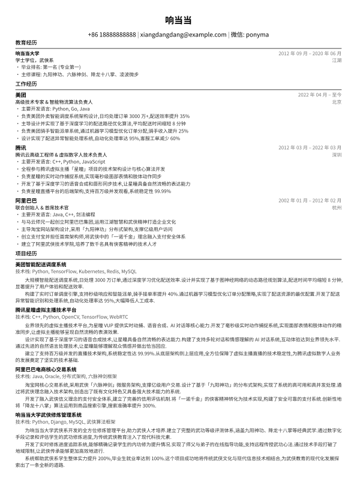

# WonderCV - 基于 Typst 的现代化双语简历模板



一个专业的双语（中文/英文）简历管理系统，基于现代化的 Typst 排版引擎构建。该系统采用模块化架构设计，具备智能数据管理、跨平台字体管理和自动化构建系统。

## ✨ 特性

- 🎨 **现代化排版**: 基于 Typst 的专业排版系统，输出精美的 PDF、SVG 和 PNG 格式
- 🌍 **双语支持**: 完整的中英文双语模板，支持独立数据管理
- 📦 **模块化架构**: 简历数据按逻辑模块分离（基本信息、教育经历、工作经历、项目经历）
- ⚡ **智能构建系统**: 基于时间戳的增量编译，支持依赖追踪
- 🔧 **一键环境配置**: 自动化环境初始化，支持 Ubuntu/Debian/Arch Linux
- 📱 **跨平台字体管理**: 项目级字体系统，确保跨环境输出一致性
- 🚀 **开发友好**: 完整的开发工具链和热重载支持

## 🚀 快速开始

### 环境要求

- Linux 系统（支持 Ubuntu/Debian/Arch Linux）
- 网络连接（用于下载 Typst 和字体）

### 一键初始化

```bash
# 克隆项目
git clone https://github.com/moooyo/resume.git
cd resume

# 一键环境配置（必须首先执行）
make init

# 构建简历
make build    # 构建中英文版本
make zh       # 仅构建中文版本
make en       # 仅构建英文版本
```

### 自定义简历

1. **编辑基本信息**: 修改 `src/data/zh/basic.json` 或 `src/data/en/basic.json`
2. **添加教育经历**: 编辑 `src/data/zh/education.json` 或 `src/data/en/education.json`
3. **更新工作经历**: 修改 `src/data/zh/experience.json` 或 `src/data/en/experience.json`
4. **管理项目经历**: 编辑 `src/data/zh/projects.json` 或 `src/data/en/projects.json`
5. **重新构建**: 运行 `make zh` 或 `make en`

## 📁 项目结构

```
.
├── Makefile              # 智能构建系统
├── package.json          # 项目配置和脚本
├── dist/                 # 输出目录（PDF、SVG、PNG）
├── docs/                 # 文档和预览文件
├── fonts/                # 项目字体文件
├── scripts/              # 辅助脚本
│   ├── install_fonts.sh  # 字体安装脚本
│   ├── install_hooks.sh  # Git hooks 安装
│   └── ...              # 其他工具脚本
└── src/
    ├── common/           # 共享模板和样式
    │   ├── template.typ  # 主模板文件
    │   ├── style.typ     # 样式定义
    │   └── settings.typ  # 全局设置
    ├── data/             # 简历数据
    │   ├── zh/           # 中文数据
    │   │   ├── basic.json     # 基本信息
    │   │   ├── education.json # 教育经历
    │   │   ├── experience.json# 工作经历
    │   │   └── projects.json  # 项目经历
    │   └── en/           # 英文数据
    │       └── ...       # 同上结构
    ├── zh/
    │   └── resume.typ    # 中文简历入口
    └── en/
        └── resume.typ    # 英文简历入口
```

## 🛠️ 构建命令

### 核心命令

| 命令 | 功能 | 说明 |
|------|------|------|
| `make init` | **环境初始化** | 🚨 **首次必须执行**：安装 Typst、字体和依赖 |
| `make build` | 构建所有版本 | 同时构建中英文 PDF、SVG、PNG |
| `make zh` | 构建中文版本 | 智能增量编译，支持依赖检查 |
| `make en` | 构建英文版本 | 智能增量编译，支持依赖检查 |
| `make clean` | 清理输出 | 删除 dist/ 目录所有生成文件 |
| `make help` | 帮助信息 | 显示所有可用命令和详细说明 |

### 开发工具

| 命令 | 功能 |
|------|------|
| `make watch` | 文件监控模式 |
| `npm run build` | NPM 构建脚本 |
| `npm run clean` | NPM 清理脚本 |

## 📝 数据文件说明

### 基本信息 (basic.json)
```json
{
  "name": "你的姓名",
  "contact": {
    "email": "your@email.com",
    "phone": "+86 13800138000",
    "wechat": "your_wechat"
  },
  "lang_config": {
    "education": "教育经历",
    "experience": "工作经历",
    "projects": "项目经历"
  }
}
```

### 教育经历 (education.json)
```json
{
  "education": [
    {
      "institution": "学校名称",
      "degree": "学位",
      "major": "专业",
      "duration": "时间段",
      "location": "地点"
    }
  ]
}
```

### 工作经历 (experience.json)
详细的工作经历，包含公司、职位、时间、地点和主要职责描述。

### 项目经历 (projects.json)
项目经历信息，包含项目名称、技术栈、时间和详细描述。

## 🎨 自定义样式

模板系统支持深度自定义：

- **颜色主题**: 修改 `src/common/style.typ` 中的颜色变量
- **字体配置**: 更新 `src/common/settings.typ` 中的字体设置
- **布局调整**: 编辑 `src/common/template.typ` 中的布局逻辑

## 🔧 系统要求与兼容性

### 支持的操作系统
- ✅ Ubuntu 20.04+
- ✅ Debian 11+
- ✅ Arch Linux
- ✅ 其他基于 systemd 的 Linux 发行版

### 字体支持
- **中文**: Source Han Sans SC (思源黑体)
- **英文**: Inter 字体家族
- **自动安装**: `make init` 会自动安装所需字体

## 📄 输出格式

每次构建会生成多种格式：

- **PDF**: 高质量打印版本 (`resume-zh.pdf`, `resume-en.pdf`)
- **SVG**: 矢量格式，适合网页展示 (`resume-zh-*.svg`, `resume-en-*.svg`)
- **PNG**: 高分辨率位图 (300 DPI) (`resume-zh-*.png`, `resume-en-*.png`)

## 🤝 贡献

欢迎提交 Issue 和 Pull Request！

## 📄 许可证

MIT License - 详见 [LICENSE](LICENSE) 文件

## 🙏 致谢

- [Typst](https://typst.app/) - 现代化排版引擎
- [Inter](https://rsms.me/inter/) - 优秀的英文字体
- [Source Han Sans](https://source.typekit.com/source-han-sans/) - 思源黑体中文字体

---

⭐ 如果这个项目对你有帮助，请给个 Star！
